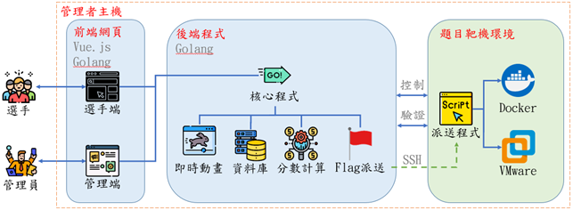

# 模訓平臺

## 介紹

平臺為前後端分離架構，前端區分選手及管理端網頁，後端串接核心程式、資料庫、即時動畫、Flag派送及題目靶機等模組



## 開發

編譯環境+打包步驟參考

https://docs.google.com/document/d/1YNBkrJjrI_7HvLGbimw9Ws5cgBtaQ7Rcx-IXlrRZIew/edit#heading=h.idbvuriskay4

## 開始使用

### Release

有用Go編譯，直接下載解壓縮執行即可。

```
# 解壓縮
tar -zxvf Cardinal.tar.gz

# 賦予執行權限
chmod +x ./Cardinal

# 執行
./Cardinal
```

### 網頁入口

預設port：`19999`

選手端 `http://localhost:19999/`

後台管理 `http://localhost:19999/manager`

## 靶機

### 已建立


### 預計建立
